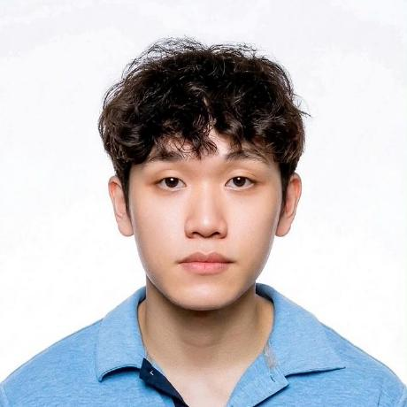
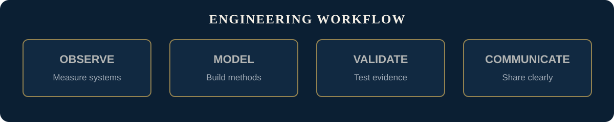

  

Figure 1. Engineering interests spanning intelligent vision, learning systems, electronics, and telecommunications.

  

<h1 align="center">Tran Si Nam</h1>

  <strong>Electronics and Telecommunications Engineering Student</strong> 
  Computer Vision | Machine Learning | Computer Networks | Telecommunications

  
  
  
  
  
  

## About

I am a senior undergraduate in Electronics and Telecommunications Engineering at the Faculty of Electronics and Telecommunications, University of Science, Viet Nam National University Ho Chi Minh City (VNUHCM-US). My current work centers on computer vision and machine learning, supported by coursework in computer networks and telecommunications. I value careful experimentation, reproducible results, and clear technical communication.

I defended my undergraduate thesis on August 15, 2026, and I am open to internship opportunities in computer vision, machine learning, computer networks, network communications, and telecommunications.

| Profile | Details |
| --- | --- |
| School | [VNUHCM-University of Science](https://en.hcmus.edu.vn/overview/) |
| Faculty | [Faculty of Electronics and Telecommunications (FETEL)](https://fetel.hcmus.edu.vn/en/introduction/) |
| Program | Electronics and Telecommunications Engineering |
| Current focus | Computer vision and machine learning |
| Engineering foundation | Computer networks and telecommunications |
| Location | Ho Chi Minh City, Vietnam |
| Time zone | Indochina Time, UTC+7 (GMT+7) |

## Current Direction

- Apply computer vision and machine learning to practical engineering problems.
- Strengthen reliable data, experimentation, and model-evaluation workflows.
- Build deeper expertise in connected systems, networks, and telecommunications.
- Present technical work with concise documentation and reproducible evidence.

  
  
  
  

## Resume

My one-page resume uses a simple, single-column Typst layout designed for applicant tracking systems and internship applications. It includes only confirmed skills, dates, project responsibilities, tools, and clearly attributed quantitative results.

  
  
  

Last updated: August 25, 2026.

## Featured Projects

  

### YOLO11 Dangerous-Person Detection in Public Areas

A responsible computer-vision research prototype that identifies people associated with potentially dangerous objects in public-area imagery. The repository presents the thesis evidence, held-out test results, reproducibility guidance, documented limitations, and versioned research artifacts.

| Dataset | Instances | Selected model | Held-out test result |
| --- | --- | --- | --- |
| 3,140 images | 10,595 labeled people | YOLO11s | mAP50 0.80; mAP50-95 0.64 |

  
  

This prototype supports human review; it must not be used as proof of identity, intent, guilt, or future behavior.

### Vietnamese Automatic License Plate Recognition with YOLO and OCR

  
  
  
  

A seven-person Introduction to Artificial Intelligence course project developed from January through April 2026. The pipeline uses YOLO to localize Vietnamese license plates, FastALPR and fast-plate-ocr to decode cropped plates, normalization for consistent plate strings, and annotated image or video output for a LAN-based whitelist demonstration.

| Team | My confirmed responsibilities | Team-reported validation results | Scope |
| --- | --- | --- | --- |
| Seven students | Dataset and YOLO-label review, data-configuration checks, multi-format FFmpeg and annotated-output testing, and error-case validation | Precision 99.45%; recall 99.37%; mAP50 99.45%; mAP50-95 77.01% | Academic dataset and LAN prototype |

  
  

The original team-repository URL is retained while it is being restored; the case study remains available as the stable reviewer link. The prototype was not validated for production traffic enforcement or unattended access control.

## Engineering Method

  

Figure 2. A disciplined workflow for developing and communicating engineering results.

I approach technical work through four principles: define the problem clearly, select methods deliberately, test claims against evidence, and communicate results so that others can reproduce them.

## Contact

| Channel | Contact |
| --- | --- |
| LinkedIn | [linkedin.com/in/nambekai](https://www.linkedin.com/in/nambekai/) |
| Work email | [nambekai123@gmail.com](mailto:nambekai123@gmail.com) |
| Academic email | [22207062@student.hcmus.edu.vn](mailto:22207062@student.hcmus.edu.vn) |
| Telephone | [+84 91 555 1529](tel:+84915551529) |
| Facebook | [nam.tran.331598](https://www.facebook.com/nam.tran.331598) |

For professional inquiries, email or LinkedIn is preferred. My working time zone is UTC+7 (GMT+7).

## Frequently Asked Questions

<strong>What areas are you developing?</strong>

My primary areas are computer vision and machine learning, with a broader engineering foundation in computer networks and telecommunications.

<strong>What kind of work do you value?</strong>

I value technically sound work with explicit assumptions, measurable results, reproducible methods, and clear documentation.

<strong>What is the best way to make contact?</strong>

For professional communication, use LinkedIn or the work email address above. For university matters, use the academic email address.

---

  Engineering with rigor. Learning with purpose. Communicating with clarity.

